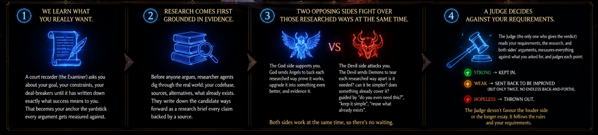

<div align="center">

# Celestial Court ⚖️

*"Put your idea on trial before you build it"*


</div>

Got an idea? An argument? A warning? **Celestial Court puts it on trial** before you commit to it — so you never build something that should never have been built, and you never kill something that deserved a chance.

---

## Table of contents

- [How it works](#how-it-works)
- [Install](#install)
- [Use it](#use-it)
- [Optional add-ons](#optional-add-ons)
- [Using Celestial Court outside Claude Code](#using-celestial-court-outside-claude-code)
- [Commands](#commands)
- [License](#license)

---

## How it works



### 1. We learn what you really want
A court recorder (the **Examiner**) asks about your goal, your constraints, and your deal-breakers until it has written down exactly what success means to *you*. That becomes your **anchor** — the yardstick every argument gets measured against.

### 2. Research comes first, grounded in evidence
Before anyone argues, **researcher agents** dig through the real world: your codebase, sources, alternatives, and what already exists. They write it all up as a **research brief**, with every claim backed by a source.

### 3. Two sides argue over the researched options, at the same time
| Side | Role | Guided by |
|---|---|---|
| 😇 **God** | Sends **Angels** to back each researched option, prove it works, and upgrade it into something better | "Make it work, make it better" |
| 😈 **Devil** | Sends **Demons** to tear each option apart | "Do you even need this?", "keep it simple", "reuse what already exists" |

Both sides work in parallel, so there's no waiting on each other.

### 4. A Judge rules against *your* requirements
The Judge — the only one who delivers a verdict — reads your requirements, the research, and both sides' arguments, and scores every point:

- **Strong** → kept in.
- **Weak** → sent back for improvement, but only **twice** — no endless back-and-forth.
- **Hopeless** → thrown out.

The Judge doesn't favor the louder side or the longer essay. It follows the rules, and *your* requirements.

### 5. You get the verdict and the path
- **ADOPT** — do it (usually the improved, upgraded version).
- **ADOPT-WITH-CONDITIONS** — do it, but fix these things first.
- **REJECT** — don't do it, and here's exactly why.
- **SPLIT** — some of it is worth keeping, some isn't.

Everything is written down as plain files you can open, so you always know *why* a decision was made — and you get a clear, optimized path to your goal.

---

## Install

No registration, no approval — just two commands inside **Claude Code**:

```bash
/plugin marketplace add LokeshDandumahanti/Celestial_Court
/plugin install celestialcourt@celestialcourt
```

The `/celestialcourt` command becomes available on your next session.

---

## Use it

```bash
/celestialcourt "We should add Redis caching to the API"
/celestialcourt --case path/to/proposal.md
```

Then run `/celestialcourt-setup` — it checks for the optional add-on skills that sharpen each side, and installs them only with your OK.

---

## Optional add-ons

The trial already works on its own. These just sharpen the two sides, and Celestial Court **never installs them automatically** — it tells you what's missing and installs only if you say yes.

| Side | Add-ons | What they add |
|---|---|---|
| 😈 Devil | `ponytail`, `code-simplifier`, `security-guidance`, `grill-me` | Extra ammunition for "keep it simple," "reuse," and "is this secure?" |
| 😇 God | `frontend-design`, `artifact-design`, `dataviz` | Extra power for showing what's possible and making it beautiful |

---

## Using Celestial Court outside Claude Code

Celestial Court is built and distributed as a **Claude Code plugin**, and the one-command install above (`/plugin marketplace add ...`) currently only works there.

Other agent harnesses have their own, incompatible plugin/extension formats — for example, Codex CLI has its own plugin marketplace (`/plugins`, `codex plugin marketplace add`), and various DeepSeek-based agent harnesses (DeepSeek Harness/`dsh`, Deep Code CLI, and others) each have their own skill or extension mechanisms. There isn't a native Celestial Court package for any of these yet.

If your harness can read Markdown-based skill or prompt files (most can — via `SKILL.md`, `AGENTS.md`, or a custom prompts folder), you can bring Celestial Court along manually:

1. Clone this repo: `git clone https://github.com/LokeshDandumahanti/Celestial_Court`
2. Copy the agent/skill definitions into whatever location your harness reads instructions from (for example, Codex CLI's `~/.codex/prompts`, or your harness's equivalent).
3. Adjust any Claude-Code-specific syntax (like slash-command frontmatter) to match your harness's format.

This works, but it's manual and unofficial — behavior may drift from the Claude Code version as this project evolves. Native packages for other harnesses are a possible future addition; if you'd like to help build one, contributions are welcome.

---

## Commands

| Command | Description |
|---|---|
| `/celestialcourt <suggestion>` | Put an idea, argument, or caution on trial |
| `/celestialcourt-setup` | Check and set up the optional add-ons |

---

## License

MIT
