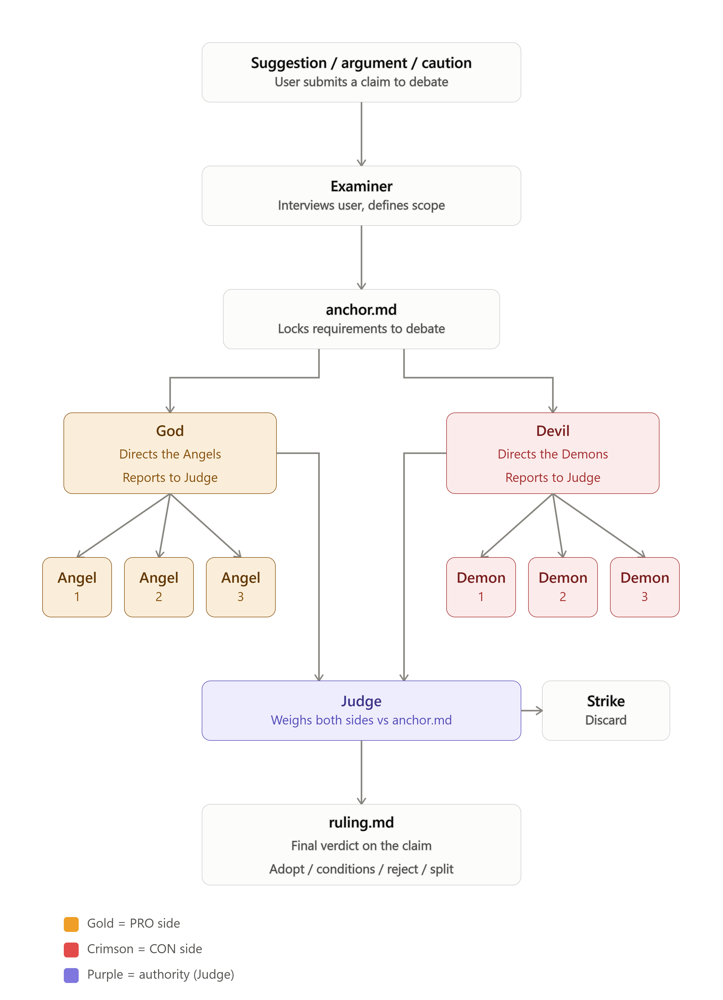

# Celestial Court ⚖️ put your idea on trial before you build it

> *"Put it through purgatory before it ships."*

<p align="center">
  
</p>

Got an idea? An argument? A warning? **Celestial Court puts it on trial**
before you commit to it so you never build something that should never
have been built, and you never kill something that deserved a chance.

## What actually happens

**1. We learn what you really want.**

A court recorder (the *Examiner*) asks you about your goal, your
constraints, your deal-breakers until it has written down exactly what
success means to *you*. That becomes your **anchor** the yardstick every
argument gets measured against.

**2. Research comes first grounded in evidence.**

Before anyone argues, **researcher agents** dig through the real world:
your codebase, sources, alternatives, what already exists. They write down
the candidate ways forward as a **research brief** every claim backed by
a source.

**3. Two opposing sides fight over those researched ways at the same
time.**

- The **God side** supports you. God sends **Angels** to back each
  researched way prove it works, upgrade it into something even better,
  and evidence it.
- The **Devil side** attacks you. The Devil sends **Demons** to tear each
  researched way apart is it needed? can it be simpler? does something
  already cover it? guided by *"do you even need this?"*, *"keep it
  simple"*, *"reuse what already exists"*.

Both sides work at the same time, so there's no waiting.

**4. A Judge decides against *your* requirements.**

The Judge (the only one who gives the verdict) reads **your requirements,
the research, and both sides' arguments**, measures everything against
what you asked for, and judges each point:

- **Strong** → kept in.
- **Weak** → sent back to be improved but only **twice**, no endless
  back-and-forth.
- **Hopeless** → thrown out.

The Judge doesn't favour the louder side or the longer essay. It follows
the rules and *your* requirements.

**5. You get the verdict and the path.**

The final ruling tells you exactly what to do:

- **ADOPT** do it (usually the improved, upgraded version).
- **ADOPT-WITH-CONDITIONS** do it, but fix these things first.
- **REJECT** don't do it, and here's exactly why.
- **SPLIT** some of it is worth keeping, some isn't.

Everything is written down as plain files you can open, so you always know
*why* a decision was made and you get a clear, optimised path to actually
reach your goal.



## Install

No registration, no approval just two commands inside Claude Code:

```bash
/plugin marketplace add LokeshDandumahanti/Celestial_Court
/plugin install celestialcourt@celestialcourt
```

The `/celestialcourt` command becomes available on your next session.

## Use it

```
/celestialcourt "We should add Redis caching to the API"
/celestialcourt --case path/to/proposal.md
```

Then `/celestialcourt-setup` checks and, with your OK, installs the
optional add-on skills that make each side sharper.

## Optional add-ons

The trial already works on its own. These just sharpen the two sides:

- **Devil's side:** ponytail, code-simplifier, security-guidance, grill-me
  extra ammunition for "keep it simple", "reuse", "is this secure?"
- **God's side:** frontend-design, artifact-design, dataviz extra power
  for showing what's possible and making it beautiful.

Celestial Court **never installs these by itself**. It tells you what's
missing, and installs only if you say yes.

## Commands

- `/celestialcourt <suggestion>` put an idea, argument, or caution on trial
- `/celestialcourt-setup` check and set up the optional add-ons

## License

MIT
